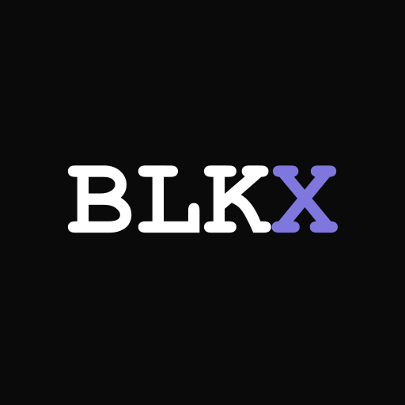
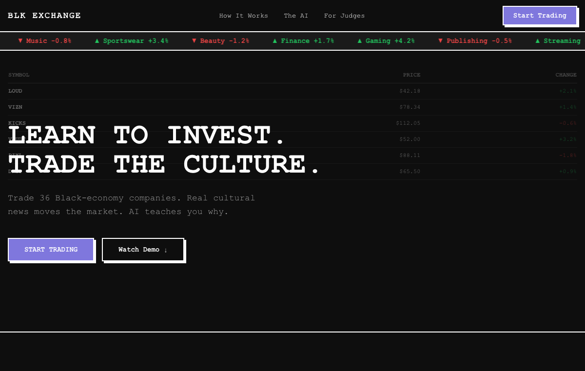

<p align="center">
  
</p>

<h1 align="center">BLK Exchange</h1>

<p align="center">
  <strong>Learn to Invest. Trade the Culture.</strong><br/>
  A culturally grounded stock market simulator for financial literacy.
</p>

<p align="center">
  <a href="https://blk-exchange.vercel.app">Live App</a> &middot;
  <a href="https://blk-exchange.vercel.app/judges">Judges View</a> &middot;
  <a href="docs/blk-exchange-research-paper.md">Research Paper</a>
</p>

<p align="center">
  
</p>

---

## The Problem

The financial literacy gap between Black and White Americans is not a matter of individual effort. It is structurally reinforced and persistent. Black Americans answer an average of 37% of financial literacy questions correctly, compared to 55% for White Americans. Only 18% of Black households own stocks, bonds, and mutual funds, compared to 35% of White households. For every $100 in wealth held by White families, Black families hold $15.

And here's what makes it worse: education alone doesn't close the gap. Even among highly educated individuals, Black Americans exhibit lower financial literacy than similarly educated White Americans, because the structural conditions surrounding that degree --- family wealth, intergenerational knowledge transfer, labor market access --- are fundamentally different.

The existing tools weren't built for this audience. Generic stock simulators trade Apple and Tesla with news from Bloomberg and CNBC. They assume a baseline of cultural familiarity with the stock market that Black Americans disproportionately lack. They teach trading mechanics without teaching financial reasoning. The learning is incidental and unstructured, dependent on preexisting curiosity and knowledge.

**BLK Exchange takes a different approach.**

## What BLK Exchange Does

BLK Exchange is a financial literacy game disguised as a stock trading app. Players start with $10,000 in virtual cash and trade 36 fictional companies that represent the sectors shaping Black cultural and economic life: a podcast network (LOUD), a natural hair care brand (CROWN), a streetwear label (DRIP), a Black-owned streaming platform (VIZN), a community bank (VAULT), an athletic footwear company (KICKS).

Real cultural news from Black media publications drives the market. When a headline drops about a streaming deal or a sneaker collaboration, prices move. An AI coach explains the investing concept behind each move --- diversification, sector correlation, risk tolerance, earnings reports --- not as a lecture, but as context for the decision you're already making.

The hidden curriculum: by the time a player has traded through a few sessions, they've learned 23 investing concepts across four tiers, from "Supply & Demand" to "Generational Wealth." They learned them because they experienced them, not because someone assigned them.

## Why It Works: Three Research Pillars

BLK Exchange is built on the convergence of three evidence-backed principles:

### 1. Game-Based Learning

A 2024 randomized controlled trial of 2,220 students across four countries found that game-based financial education improved literacy by 0.313 standard deviations. A University of San Francisco study found that game-based interventions didn't just teach facts --- they changed how participants felt about their ability to navigate financial systems (Agency Index increase of 0.4985, p < 0.01). Games work. Especially for financial literacy.

### 2. Culturally Responsive Education

Research from NYU's Metropolitan Center for Research on Equity found that students who received culturally relevant teaching reported more positive academic outcomes and positive racial identity development. When financial concepts are embedded in culturally resonant narratives, comprehension improves because the learner has an existing schema to attach new knowledge to. A fictional Black media company is more culturally resonant than Apple Inc. for the target audience --- even though Apple is the real company.

### 3. Structured Curriculum Through Play

Unlike other simulators where learning is incidental, BLK Exchange embeds a 23-concept curriculum directly into gameplay through a "curriculum debt queue." The system tracks which concepts each player has encountered and biases event generation toward the gaps. Every player, over the course of a season, is guaranteed to encounter all 23 concepts. No lectures. No forced progression. Just gameplay that teaches.

> For the full research paper with 28 peer-reviewed citations, see [docs/blk-exchange-research-paper.md](docs/blk-exchange-research-paper.md).

---

## Features

### The Market
- **36 fictional companies** across 12 sectors of the Black economy
- **Real-time prices** via Convex subscriptions --- all players see the same market
- **Scrolling sector marquee** with live price changes
- **Yahoo Finance-style layout** with neobrutalism dark mode styling

### Trading
- **Market orders** by dollar amount (fractional shares supported)
- **25% dynamic position limit** prevents over-concentration
- **Atomic execution** --- trades are all-or-nothing Convex mutations
- **$10,000 starting capital** with seasonal resets

### Dual AI System
- **Groq** (llama-3.3-70b at 758 tok/sec) --- generates fictional market events, classifies real news articles to tickers and concepts, produces real-time commentary
- **Claude** (Sonnet 4.6) --- grades portfolio diversification, answers investing questions using your actual holdings, generates personalized session debriefs
- **ElevenLabs** (Flash v2.5) --- reads market alerts aloud the moment they drop

### Knowledge Vault
- **23 financial literacy concepts** across 4 tiers: Foundation, Intermediate, Advanced, Economics
- **Hybrid unlocking** --- ~15 behavior-driven (your portfolio proves the concept) + ~8 event-driven
- **Curriculum debt queue** --- AI generates events targeting your unlearned concepts
- **Shareable concept cards** with OG image generation

### News Pipeline
- **Firecrawl** scrapes curated Black media publications every 15 minutes
- **Perplexity** researches broader cultural and economic trends
- **Groq** generates fictional company lifecycle events 3x daily
- All articles are classified to map to specific tickers and investing concepts

### Progressive Web App
- **Installable** on mobile home screens (Android + iOS)
- **Animated splash screen** with 8-phase timeline on launch
- **Service worker** with network-first navigation, cache-first static assets
- **Offline fallback** when connectivity is lost

### Competition
- **5 leaderboards**: Portfolio Value, Knowledge Vault, Diversification Score, Biggest Mover, The Blueprint Award
- **8-week seasons** with themed weeks and championship
- **Daily streaks** with capital bonuses

---

## The 36 Tickers

| Sector | Tickers | Examples |
|--------|---------|----------|
| Media & Content | LOUD, SCROLL, VERSE | Podcast network, digital media, literary platform |
| Streaming | VIZN, NETFLO, LIVE | Black-owned streaming, corporate streaming, live events |
| Music | RYTHM, BLOC, CRATE | Music distribution, indie label, music discovery |
| Gaming | PIXL, MOBILE, SQUAD | Game studio, mobile gaming, esports org |
| Sportswear | KICKS, FLEX, COURT | Athletic footwear, apparel, equipment |
| Fashion | DRIP, RARE, THREAD | Streetwear, limited drops, creator merch |
| Publishing | INK, READS, PRESS | Book publishing, digital reading, indie press |
| Beauty | CROWN, GLOW, SHEEN | Hair care, skincare, salon chain |
| Finance | VAULT, STAX, GROW | Community bank, fintech, CDFI lending |
| Real Estate | BLOK, BUILD, HOOD | REIT, construction, affordable housing |
| Sports | DRAFT, ARENA, STATS | Athlete agency, sports venues, analytics |
| Entertainment | SCREEN, STAGE, GAME | Film studio, live events, gaming |

---

## Tech Stack

| Layer | Technology |
|-------|-----------|
| Frontend | Next.js 14 (App Router), React 18, Tailwind CSS, shadcn/ui |
| Backend | [Convex](https://convex.dev) --- real-time database + serverless functions |
| Auth | [Clerk](https://clerk.com) --- authentication + user management |
| AI (Deep) | Claude Sonnet 4.6 --- coaching, debriefs, Q&A |
| AI (Fast) | Groq llama-3.3-70b --- events, classification, commentary |
| TTS | ElevenLabs Flash v2.5 --- voice narration |
| News | Firecrawl + Perplexity |
| Hosting | Vercel + Convex Cloud |
| Design | Neobrutalism dark theme (`Courier New`, hard corners, #7F77DD purple) |

---

## Quick Start

### Prerequisites

- Node.js 20+, pnpm 9+
- [Convex](https://convex.dev) account (free tier)
- [Clerk](https://clerk.com) account (free tier)

### Install & Run

```bash
git clone https://github.com/tmoody1973/blk-exchange.git
cd blk-exchange
pnpm install

# Set environment variables
cp .env.example .env.local
# Fill in NEXT_PUBLIC_CONVEX_URL, CLERK keys, CONVEX_DEPLOYMENT

# Start development
pnpm dev
```

### Seed the Database

```bash
npx convex run seed:seedDatabase
```

This inserts all 36 tickers and company states.

### AI Keys

Set AI service keys as Convex environment variables:

```bash
npx convex env set GROQ_API_KEY <key>
npx convex env set ANTHROPIC_API_KEY <key>
npx convex env set ELEVENLABS_API_KEY <key>
npx convex env set FIRECRAWL_API_KEY <key>
```

### Deploy

```bash
npx convex deploy          # Backend
npx vercel --prod           # Frontend
```

---

## Project Structure

```
blk-exchange/
├── convex/                    # Backend (Convex)
│   ├── schema.ts              # 17-table database schema
│   ├── market.ts              # Price engine
│   ├── trades.ts              # Atomic trade execution
│   ├── vault.ts               # Knowledge Vault + concept unlocking
│   ├── eventScheduler.ts      # Event firing logic
│   ├── curriculumDebt.ts      # Curriculum gap tracking
│   ├── crons.ts               # Scheduled jobs (events, news, resets)
│   ├── claude/                # Claude AI actions
│   ├── groq/                  # Groq AI actions
│   └── news/                  # Firecrawl + Perplexity pipeline
├── src/
│   ├── app/                   # Next.js App Router
│   │   ├── (app)/             # Authenticated: market, portfolio, vault, profile, news, guide
│   │   ├── (landing)/         # Public: landing page, judges view
│   │   ├── share/             # Public share pages with OG meta for social crawlers
│   │   └── api/               # OG image cards, TTS endpoint
│   ├── components/            # UI organized by feature domain
│   └── middleware.ts          # Clerk auth + route protection
├── public/                    # PWA manifest, service worker, icons, splash, share cards
└── docs/                      # Research paper, game mechanics, press release, plans
```

---

## The Bigger Picture

The racial wealth gap took centuries to construct. It will not be dismantled by a game. But the evidence suggests that the on-ramp to financial participation can be redesigned. If a young person in Milwaukee, Atlanta, or Detroit spends a season making trading decisions in a culturally familiar environment, encountering investing concepts through gameplay rather than lectures, and building investment comfort before they ever open a real brokerage account --- the research says that matters.

The knowledge gap narrows. The psychological barrier to market participation lowers. The language of finance becomes less foreign.

Black culture IS an economy. BLK Exchange treats it like one.

---

## AI Transparency

BLK Exchange was built entirely with AI coding assistance. Full transparency on what AI tools were used and how:

| What | AI Tool | How It Was Used |
|------|---------|-----------------|
| Application code | Claude Code (Anthropic) | All frontend, backend, and infrastructure code was written by directing Claude Code through natural language. The author is not a software developer. |
| Research paper | Claude (Anthropic) | AI assisted with research discovery, source synthesis, and drafting. All 28 citations are real, verified sources. Arguments and analysis are the author's own. |
| AI coaching (in-app) | Claude Sonnet 4.6 | Portfolio grading, session debriefs, and Q&A during gameplay |
| Event generation (in-app) | Groq llama-3.3-70b | Market event creation, article classification, real-time commentary |
| News discovery (in-app) | Perplexity Sonar | AI-powered news search across Black media publications |
| Voice narration (in-app) | ElevenLabs Flash v2.5 | Text-to-speech for market alerts |
| Demo video voiceover | ElevenLabs | Voiceover for the hackathon demo video |
| Share card backgrounds | Gemini 3.1 Flash Image (Nano Banana 2) | AI-generated card template backgrounds |
| Press materials | Claude (Anthropic) | AI assisted with press release drafting and pitch email structure |

The author reviewed, edited, and approved all AI-generated output. The product vision, design decisions, research arguments, and educational approach are the author's own.

---

<p align="center">
  Built by <strong>Tarik Moody</strong> for <strong>Hackonomics 2026</strong><br/>
  <a href="https://buymeacoffee.com/tarikmoody">Support this project</a>
</p>

<p align="center">
  <em>BLK Exchange is a financial literacy education tool. All companies, prices, and market events are fictional. No real money is involved.</em>
</p>
